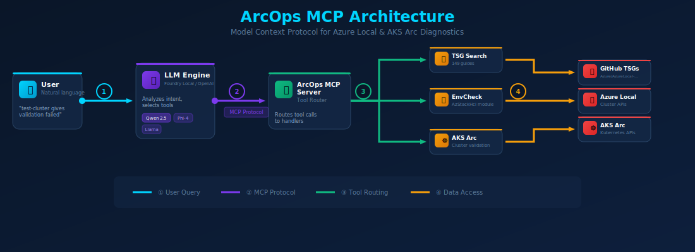

# ArcOps MCP

[](https://modelcontextprotocol.io)
[](https://github.com/microsoft/foundry-local)
[](https://www.python.org/downloads/)
[](LICENSE)
[](.)

---

## ⚠️ Project Status: Learning Project (Archived)

**This repository is a personal learning/exploration project, not production-ready software.**

I built this to explore:
- Model Context Protocol (MCP) architecture and patterns
- Local AI inference with Foundry Local
- Tool orchestration for Azure Local / AKS Arc diagnostics
- React + FastAPI full-stack development

---

> **AI-powered diagnostic assistant for Azure Local and AKS Arc** — powered by Model Context Protocol (MCP) and local AI models.

ArcOps MCP provides a conversational interface for troubleshooting Azure Local and AKS Arc deployments. Ask questions in natural language and get diagnostic insights from official Microsoft tools.

## 🏗️ Architecture



**[View Interactive Diagram →](diagrams/arcops-architecture-horizontal.html)** *(open locally for animations)*

## ✨ Features

- **🤖 AI Chat Interface** — Natural language troubleshooting powered by local SLMs
- **🔧 MCP Tool Integration** — Standardized Model Context Protocol for AI agents
- **📊 Real Diagnostics** — Wraps official Microsoft tools (no fake data)
- **🔍 TSG Search** — Search 149 Azure Local troubleshooting guides via [AzLocalTSGTool](https://github.com/smitzlroy/azlocaltsgtool)
- **📦 Offline Capable** — All AI models run entirely on your machine

## 🚀 Quick Start

### Prerequisites

- Windows 10/11 or Windows Server 2019+
- Python 3.11+
- [Foundry Local](https://github.com/microsoft/foundry-local) (for AI chat)
- Node.js 18+ (for UI)

### Installation

```powershell
# Clone the repository
git clone https://github.com/smitzlroy/arcops-mcp
cd arcops-mcp

# Create virtual environment and install
python -m venv .venv
.\.venv\Scripts\Activate.ps1
pip install -e ".[dev]"

# Install PowerShell modules for diagnostics
Install-Module -Name AzStackHci.EnvironmentChecker -Force
Install-Module -Name AzLocalTSGTool -Force
Install-Module -Name Support.AksArc -Force
```

### Start the Server

```powershell
# Start MCP server
python -m cli server --port 8080

# Start Foundry Local with a model
foundry model run qwen2.5-0.5b

# Start the UI
cd ui && npm install && npm run dev
```

Open **http://localhost:5173** and start chatting!

### One-Click Start

```powershell
# Full setup and run (first time)
.\start.ps1

# Skip installation (already set up)
.\start.ps1 -SkipInstall

# Use a different model
.\start.ps1 -Model "phi-4-mini"
```

## 🔌 Connect to Your IDE

ArcOps MCP can be used with any MCP-compatible client.

### VS Code / GitHub Copilot

Add to `.vscode/mcp.json` in your project:

```json
{
  "mcpServers": {
    "arcops": {
      "command": "python",
      "args": ["-m", "cli", "server"],
      "cwd": "C:\\path\\to\\arcops-mcp"
    }
  }
}
```

### Claude Desktop

Edit `%APPDATA%\Claude\claude_desktop_config.json`:

```json
{
  "mcpServers": {
    "arcops": {
      "command": "python",
      "args": ["-m", "cli", "server"],
      "cwd": "C:\\path\\to\\arcops-mcp"
    }
  }
}
```

### Cursor IDE

Add to `.cursor/mcp.json` in your project:

```json
{
  "mcpServers": {
    "arcops": {
      "command": "python",
      "args": ["-m", "cli", "server"],
      "cwd": "C:\\path\\to\\arcops-mcp"
    }
  }
}
```

### Any OpenAI-Compatible Client

```python
from openai import OpenAI

client = OpenAI(
    base_url="http://127.0.0.1:8082/api",
    api_key="not-needed"
)

response = client.chat.completions.create(
    model="qwen2.5-0.5b",
    messages=[{"role": "user", "content": "Run environment check"}]
)
```

### API Endpoints

| Endpoint | Purpose |
|----------|---------|
| `/mcp` | MCP protocol (stdio-over-HTTP) |
| `/api/chat` | OpenAI-compatible chat completions |
| `/api/tools` | List available tools |
| `/api/tools/{name}/run` | Execute a specific tool |

## 💬 Usage Examples

Try asking:
- *"Check connectivity to Azure"*
- *"Validate my AKS Arc cluster"*
- *"I'm getting error 0x80004005"*
- *"Search for cluster validation issues"*

## 🔧 MCP Tools

| Tool | Description | Backend |
|------|-------------|---------|
| `arc.connectivity.check` | Azure endpoint connectivity (52+ endpoints) | `AzStackHci.EnvironmentChecker` |
| `arc.gateway.egress.check` | Arc Gateway TLS/Proxy validation | `AzStackHci.EnvironmentChecker` |
| `azlocal.envcheck` | Full environment validation | `AzStackHci.EnvironmentChecker` |
| `azlocal.tsg.search` | Search 149 troubleshooting guides | `AzLocalTSGTool` |
| `aks.arc.validate` | AKS Arc cluster health checks | `az connectedk8s` + `kubectl` |
| `aksarc.support.diagnose` | Known issue detection | `Support.AksArc` |
| `aksarc.logs.collect` | Log collection for support | `Support.AksArc` |
| `arcops.diagnostics.bundle` | Create support bundles | Local packaging |
| `azlocal.educational` | Azure Local concepts & learning | Built-in |

## 🤖 Supported Models

ArcOps works with any OpenAI-compatible API. Recommended local models via [Foundry Local](https://github.com/microsoft/foundry-local):

| Model | Size | Tool Calling |
|-------|------|--------------|
| `qwen2.5-0.5b` | 520 MB | ✅ Excellent |
| `qwen2.5-1.5b` | 1.25 GB | ✅ Excellent |
| `phi-4-mini` | 3.6 GB | ✅ Good |

## 🔒 Privacy & Security

- **All AI runs locally** — No data sent to external APIs
- **No telemetry** — Your data stays on your machine
- **Dry-run mode** — Safe testing without real operations

## 📚 Documentation

- [Architecture](docs/ARCHITECTURE.md) — System design details
- [Tool Registry](docs/TOOL_REGISTRY.md) — All MCP tools
- [Privacy & Security](docs/PRIVACY_SECURITY.md) — Data handling

## 📄 License

MIT License — see [LICENSE](LICENSE)

---

## 🎓 What This Project Taught Me

| Area | Technologies / Concepts |
|------|-------------------------|
| **MCP Protocol** | Tool definitions, stdio transport, JSON-RPC |
| **Local AI** | Foundry Local, SLMs, tool calling, OpenAI API compatibility |
| **Python** | FastAPI, async/await, Pydantic, pytest |
| **Frontend** | React, TypeScript, Vite, Tailwind CSS |
| **DevOps** | PowerShell automation, VS Code tasks, GitHub workflows |
| **Architecture** | When NOT to add abstraction layers |

**Key takeaway:** Not every problem needs an AI layer. Sometimes a well-written script is more valuable than an LLM-powered tool router.

---

**Built as a learning project** — exploring [Model Context Protocol](https://modelcontextprotocol.io) and [Foundry Local](https://github.com/microsoft/foundry-local)
